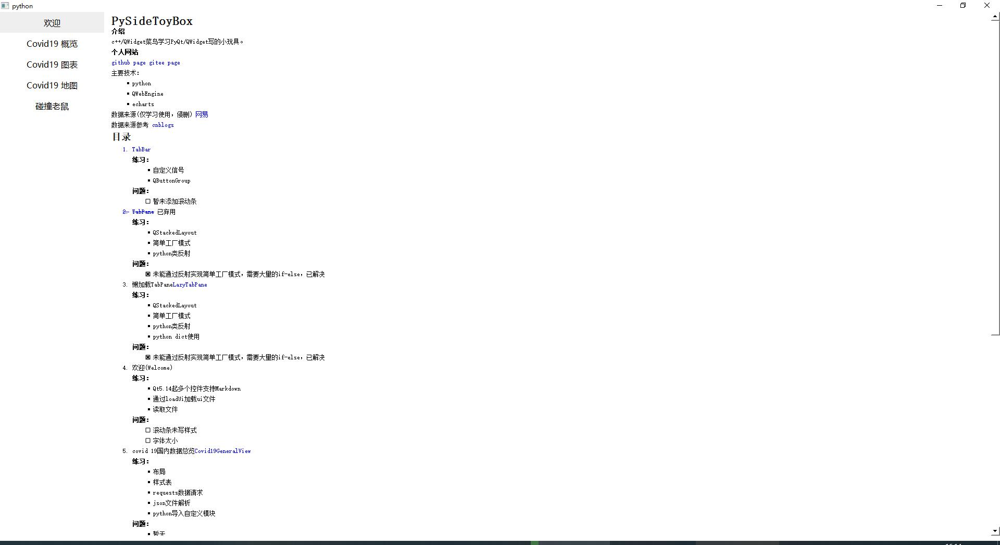
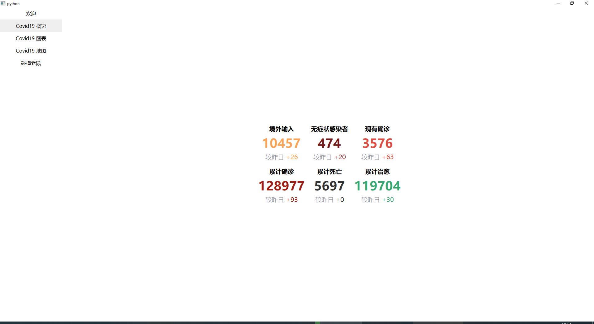
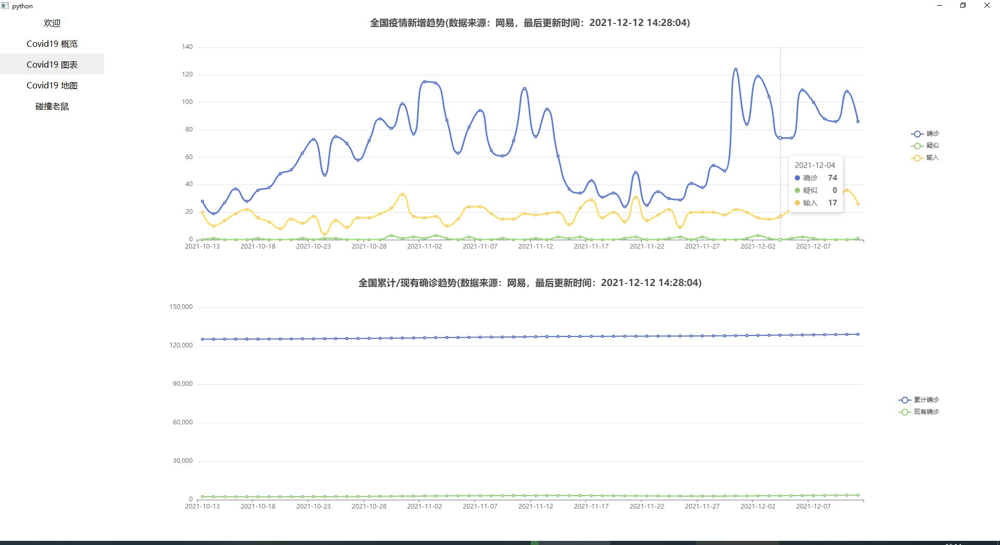
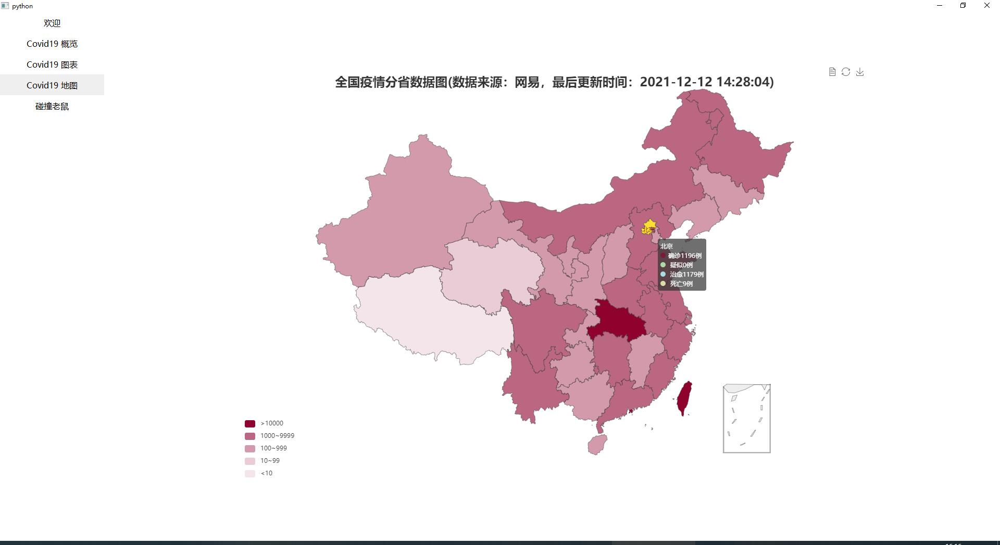
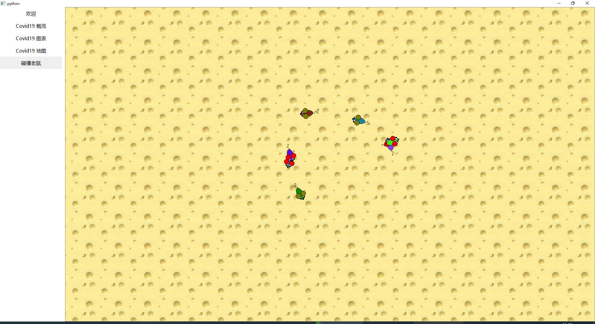
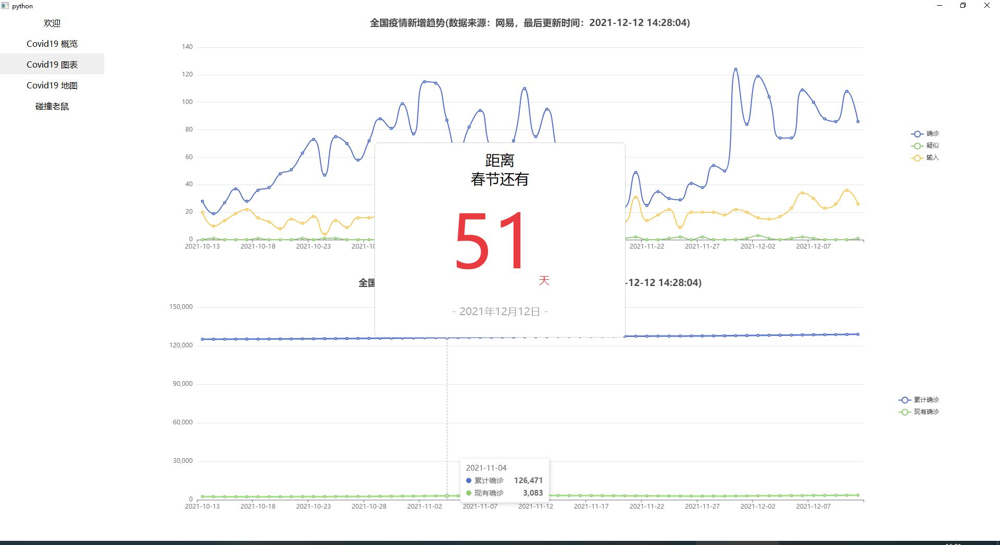

# PySideToyBox

## 介绍

c++/QWidget菜鸟学习PyQt/QWidget写的小玩具。

## 个人网站

[github page](https://noobplusplus.github.io/)
[gitee page](https://yuque.gitee.io/noob/)

主要技术：

+ python
+ QWebEngine
+ echarts

数据来源(仅学习使用，侵删)
[网易](http://c.m.163.com/ug/api/wuhan/app/data/list-total)

数据来源参考
[cnblogs](https://www.cnblogs.com/kingboy2008/p/14277084.html)

## 目录

1. [TabBar](TabBar/README.md)

    **练习：**
    + 自定义信号
    + QButtonGroup

    **问题：**
    + [ ] 暂未添加滚动条

2. ~~[TabPane](TabPane/README.md)~~ 已弃用

    **练习：**
    + QStackedLayout
    + 简单工厂模式
    + python类反射

    **问题：**
    + [x] 未能通过反射实现简单工厂模式，需要大量的if-else，已解决

3. 懒加载TabPane[LazyTabPane](LazyTabPane/LazyTabPane.py)

    **练习：**
    + QStackedLayout
    + 简单工厂模式
    + python类反射
    + python dict使用

    **问题：**
    + [x] 未能通过反射实现简单工厂模式，需要大量的if-else，已解决

4. 欢迎(Welcome)

    **练习：**
    + Qt5.14起多个控件支持Markdown
    + 通过loadUi加载ui文件
    + 读取文件

    **问题：**
    + [ ] 滚动条未写样式
    + [ ] 字体太小

    

5. covid 19国内数据总览[Covid19GeneralView](Covid19GeneralView/README.md)

    **练习：**

    + 布局
    + 样式表
    + requests数据请求
    + json文件解析
    + python导入自定义模块

    **问题：**
    + 暂无

    

6. covid 19 普通图表[Covid19Charts](Covid19Charts/README.md)

    **练习：**
    + QWidget版 WebEngineView
    + QWidget版 WebChannel
    + echarts普通图表
    + echarts dataset
    + 自定义信号槽@pyqtSlot()

    **问题：**
    + [ ] js: Uncaught TypeError: Bind must be called on a function

    

7. covid 19 地图图表[Covid19Map](Covid19Map/README.md)

    **练习：**
    + QWidget版 WebEngineView
    + QWidget版 WebChannel
    + echarts地图图表（参考[gitee-LS1211]("https://gitee.com/LS1211/map-echarts")）

    **问题：**
    + 暂无

    

8. 碰撞老鼠(PySide2 示例)[CollidingMice](CollidingMice/CollidingMice.py)

    **练习：**
    + 图形视图框架、场景、视图、自定义图形项、坐标系统
    + 动画、碰撞检测
    + QPainter绘图

    **问题：**
    + [x] 老鼠很短时间就会移出屏幕。已解决，根据C++版本修改`Rotation`相关处理

    + [x] 代码中使用太多定时器。已解决，封装独立控件，统一调用`advance()`

      > Doing the animation with a single timer connection to advance the scene ensures that all the mice are moved at one point and, more importantly, only one update is sent to the screen after all the mice have moved.

    

9. 春节倒计时[NewYearCountDown](NewYearCountDown/NewYearCountDown.py)

    **练习：**
    + 通过loadUi加载ui文件
    + desiner基本使用和修改样式
    + 控件进入/退出动画(QPropertyAnimation)

    **问题：**
    + 暂无

    
